# UseTheFork's walls

Hi! This is my repository of wallpapers which I've collected over the years.

Disclaimer: These wallpapers are sourced from many, many, many sources on the internet. I did not make any of these, although I have _edited_ several of them a little bit and use lutgen to convert them to the catppuccin-mocha colour scheme. Zero credit belongs to me in that regard, I'm simply the collector. If you are the artist of one of these wallpapers, please **[contact me](https://github.com/UseTheFork/wallpaper/issues)** I will happily take the wallpaper down or add credit in this README.

# Preview

| 1 | 2 | 3 | 4 |
| -------- | -------- | -------- | -------- |
|  |  |  |  | 
|  |  |  |  | 
|  |  |  |  | 
|  |  |  |  | 
|  |  |  |  | 
|  |  |  |  | 
|  |  |  |  | 
|  |  |  |  | 
|  |  |  |  | 
|  |  |  |  | 
|  |  |  |  | 
|  |  |  |  | 
|  |  |  |  | 
|  |  |  |  | 
| [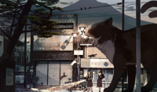](all/057.png) |  | [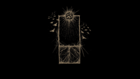](all/059.png) |  | 
|  | [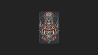](all/062.png) |  |  | 
|  | [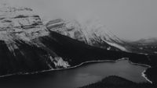](all/066.png) |  | [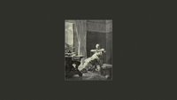](all/068.png) | 
|  |  | [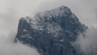](all/071.png) |  | 
| [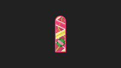](all/073.png) |  |  |  | 
|  | [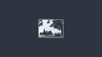](all/078.png) | [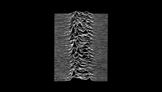](all/079.png) | [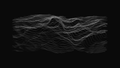](all/080.png) | 
|  |  |  |  | 
|  |  | [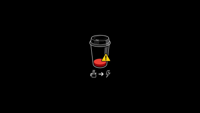](all/087.png) |  | 
|  |  |  |  | 
|  |  |  |  | 
|  |  |  |  | 
|  |  |  |  | 
|  |  |  |  | 
|  |  |  |  | 
|  |  | [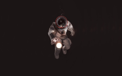](all/115.png) | [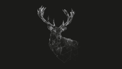](all/116.png) | 
|  |  |  |  | 
|  |  | [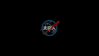](all/123.png) |  | 
|  |  |  |  | 
|  | [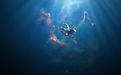](all/130.png) | 

# Credits

Special thanks to every single wallpaper creator, whom I may or may not have been able to credit. Please let me know if you are one of those people. There is nothing I would like more than to properly associate you with your work.

# Sources

These wallpapers have been collected from various sources across the internet. Here are some of the collections that inspired or contributed to this repository:

- https://github.com/orangci/walls-catppuccin-mocha
- https://github.com/zhichaoh/catppuccin-wallpapers
- https://github.com/NotAShelf/wallpkgs
- https://www.wallpaperflare.com/
- https://wallhaven.cc/
