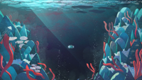
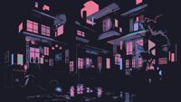

# UseTheFork's walls

Hi! This is my repository of wallpapers which I've collected over the years.

Disclaimer: These wallpapers are sourced from many, many, many sources on the internet. I did not make any of these, although I have *edited* several of them a little bit and use lutgen to convert them to the catppuccin-mocha colour scheme. Zero credit belongs to me in that regard, I'm simply the collector. If you are the artist of one of these wallpapers, please **contact me** I will happily take the wallpaper down or add credit in this README.

**Note:** Catppuccin Mocha versions of all wallpapers are automatically generated and available in the `catppuccin_mocha/` directory.

# Preview
| Column 1 | Column 2 | Column 3 | Column 4 |
| -------- | -------- | -------- | -------- |
|  |  |  |  | 
|  |  |  |  | 
|  |  |  |  | 
|  |  |  |  | 
|  |  |  |  | 
|  |  |  |  | 
|  |  |  |  | 
|  |  |  |  | 
|  |  |  |  | 
|  |  |  |  | 
|  |  |  |  | 
|  |  |  |  | 
|  |  |  |  | 
